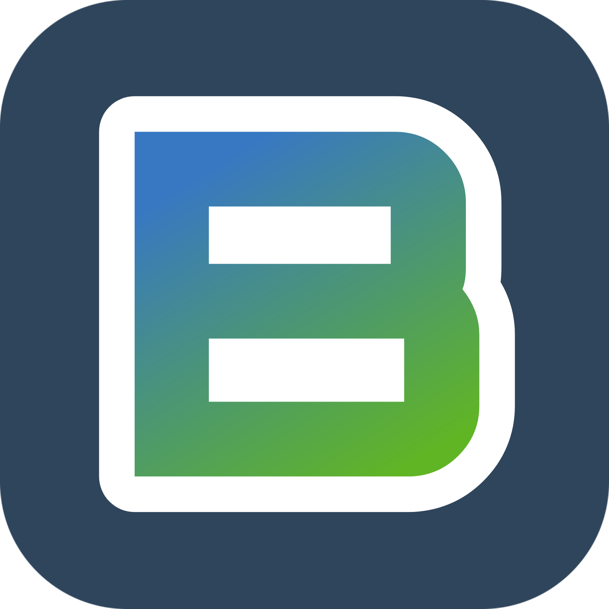

<a name="readme-top"></a>

<div align="center">
    
    <h1><b>My Budget App</b></h1>
</div>

---

<!-- ! TABLE OF CONTENTS -->

# 📗 Table of Contents

- [📖 About the Project](#about-project)
  - [🛠 Built With](#built-with)
    - [Tech Stack](#tech-stack)
    - [Key Features](#key-features)
    - [🚀 Live Demo](#live-demo)
- [💻 Getting Started](#getting-started)
  - [Prerequisites](#prerequisites)
  - [Setup](#setup)
  - [Install](#install)
  - [Usage](#usage)
  - [Run tests](#run-tests)
- [👥 Authors](#authors)
- [🔭 Future Features](#future-features)
- [🤝 Contributing](#contributing)
- [⭐️ Show your support](#support)
- [🙏 Acknowledgements](#acknowledgements)
- [📝 License](#license)

---

<!-- ! PROJECT DESCRIPTION -->

# 📖 My Budget App <a name="about-project"></a>

> My Budget App is a mobile web tool for efficient budget management. Easily track your expenses by categorizing transactions, providing a clear overview of your spending patterns.

#### Learning objectives

- Use ruby gems as software packages system.
- Install Ruby on Rails framework.
- Understand Rails RESTful design and router.
- Use controllers to handle requests and render empty views.
- Use params from browser request in a safe way.
- Use preprocessed html file with embedded Ruby code.
- Use layouts and templates for shared content.
- Use database migration files to maintain database schema.
- Use validations for models.
- Secure app from n+1 problems.
- Understand what ORM is.
- Write SQL queries with ActiveRecord.
- Set up associations between models.
- Build a webapp that requires the user to log in.
- Use devise gem for authentication.
- Analyze in writing why you have made a coding choice using one structure over another.

## 🛠 Built With <a name="built-with"></a>

### Tech Stack <a name="tech-stack"></a>

  <ul>
    <li>
      <a href="https://www.ruby-lang.org/en/">
         Ruby
      </a>
    </li>
    <li>
      <a href="https://rubyonrails.org/">
         Rails
      </a>
    </li>
    <li>
      <a href="https://www.postgresql.org/">
         PostgreSQL
      </a>
    </li>
    <li>
      <a href="https://getbootstrap.com/docs/4.0/getting-started/introduction/">
         Bootstrap
      </a>
    </li>
    <li>
      <a href="https://developer.mozilla.org/en-US/docs/Web/CSS">
         CSS
      </a>
    </li>
    <li>
      <a href="https://www.w3schools.com/html/">
         HTML5
      </a>
    </li>
  </ul>

#### Highlighted Gems

- [Devise](https://github.com/heartcombo/devise/wiki)

---

### :key: Key Features <a name="key-features"></a>

- Users can sign up and log in to the application.
- Users can create, edit, and delete categories.
- Users can create and delete transactions.

---

<p align="right">(<a href="#readme-top">back to top</a>)</p>

---

<!-- LIVE DEMO -->

## 🚀 Live Demo <a name="live-demo"></a>

- [My Budget - Live Demo Link](https://mybudget-i9f9.onrender.com/)

- [My Budget - Project Presentation](https://drive.google.com/file/d/192Uxw7_N-jgd3aoeqMoStEi8cB_meX8A/view?usp=sharing)

---

<!-- ! GETTING STARTED -->

## 💻 Getting Started <a name="getting-started"></a>

To get a local copy up and running, follow these steps.

### Prerequisites

To run this project you need:

- Have Ruby installed. If you need to install Ruby, follow the instructions on the [official page](https://www.ruby-lang.org/en/documentation/installation/).

### Setup

Clone this repository to your desired folder:

Example commands:

- With SSH:

```bash
  cd my-folder
  git clone git@github.com:ITurres/budget_app.git
```

- With HTTPS:

```bash
  cd my-folder
  git clone https://github.com/ITurres/budget_app.git
```

- With GitHub CLI:

```bash
  cd my-folder
  gh repo clone ITurres/budget_app
```

### Install <a name="install"></a>

Go to the project directory:

```bash
 cd budget_app
```

Before running the program, verify that you have Ruby on Rails installed on your OS by running the following command:

```bash
 rails --version
```

It should show you the version of Ruby On Rails ​​installed. If this does not happen and only an error message is displayed, you should verify your installation or install Ruby on Rails from scratch.

[Download and Install Ruby on Rails](https://guides.rubyonrails.org/getting_started.html)

Once you have verified that you have Ruby on Rails installed, run the following command to install the necessary gems:

```bash
 bundle install
```

After installing the gems, run the following command to create the database:

```bash
 rails db:create
```

Then run the following command to migrate the database:

```bash
 rails db:migrate
```

### Usage <a name="usage"></a>

Run the following command inside the project folder to start the application:

```bash
 rails s
```

This will start the application on your local server. You can now open your browser and go to [http://localhost:3000/](http://localhost:3000/) to see the application running.

### Run tests <a name="run-tests"></a>

To execute the tests, run the following command inside the project folder (root):

```bash
 bundle exec rspec
```

<p align="right">(<a href="#readme-top">back to top</a>)</p>

---

<!-- ! AUTHORS -->

## 👥 Authors <a name="authors"></a>

👤 **Arthur Iturres**

- GitHub: [@ITurres](https://github.com/ITurres)
- LinkedIn: [Arthur Emanuel G. Iturres](https://www.linkedin.com/in/arturoemanuelguerraiturres/)
- Angellist / Wellfound: [Arturo (Arthur) Emanuel Guerra Iturres](https://wellfound.com/u/arturo-arthur-emanuel-guerra-iturres)
- Youtube: [Arturo Emanuel Guerra Iturres - Youtube Channel](https://www.youtube.com/channel/UC6GFUFHOtBS9mOuI8EJ6q4g)
- Portfolio: [Arthur Iturres - Portfolio](https://iturres.github.io/iturres-reactive-portfolio/)

<p align="right">(<a href="#readme-top">back to top</a>)</p>

---

<!-- ! FUTURE FEATURES -->

## 🔭 Future Features <a name="future-features"></a>

- [ ] Allow users to upload images for their categories.

<p align="right">(<a href="#readme-top">back to top</a>)</p>

---

<!-- ! CONTRIBUTING -->

## 🤝 Contributing <a name="contributing"></a>

Contributions, issues, and feature requests are welcome!

Kindly open any new issues or feature requests on the [repo's issues page](https://github.com/ITurres/budget_app/issues).

<p align="right">(<a href="#readme-top">back to top</a>)</p>

---

<!-- ! SUPPORT -->

## ⭐️ Show your support <a name="support"></a>

Give a ⭐ if you liked this project!

<p align="right">(<a href="#readme-top">back to top</a>)</p>

---

<!-- ! ACKNOWLEDGEMENTS -->

## 🙏 Acknowledgments <a name="acknowledgements"></a>

I thank the **Code Reviewers** for their advice and time 🏆

💡 Original design idea by [Gregoire Vella on Behance](https://www.behance.net/gregoirevella)

<p align="right">(<a href="#readme-top">back to top</a>)</p>

---

<!-- ! LICENSE -->

## 📝 License <a name="license"></a>

This project is [MIT](./LICENSE) licensed.

<p align="right">(<a href="#readme-top">back to top</a>)</p>

---
